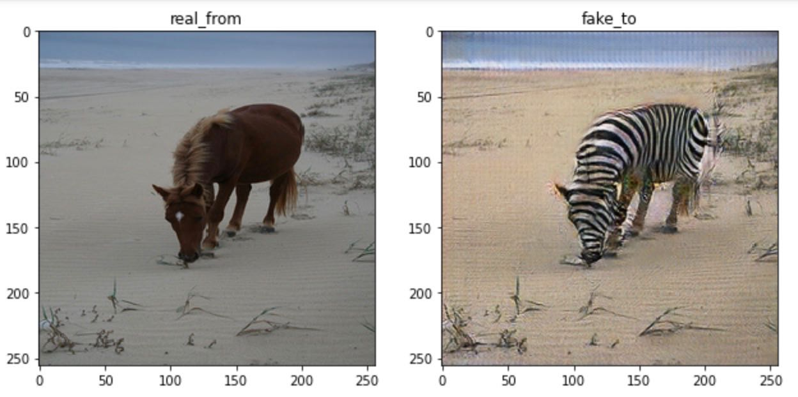
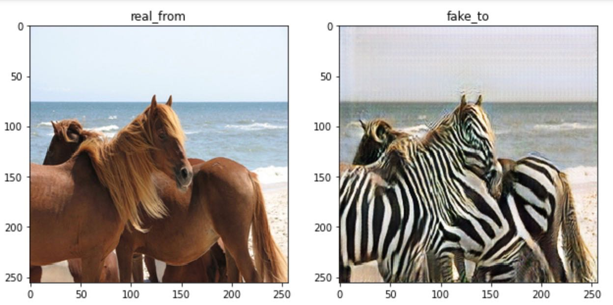
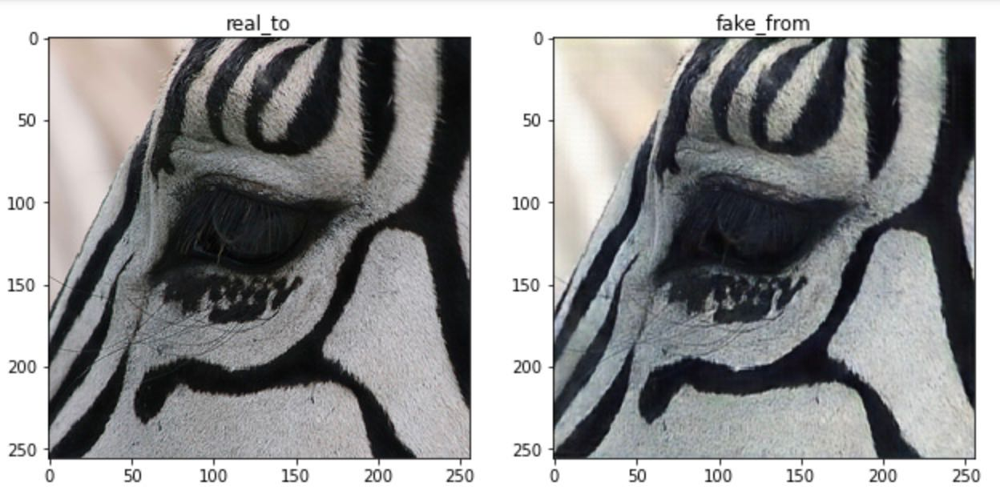

# image-gen
Re-implementation of the pix2pix and cycleGAN models. Train it from scratch.

## Learning
The pix2pix model is simple to train. U-Net and patchGAN are used. We can replicate the result in the paper with a few hours of training.

On the other hand, cycleGAN is much harder to train. This is due to the following:
* The loss function for the generator is more complex: BCE loss + cycle consistency loss + identity loss. This makes the computational graph more complex and back prop slower. These losses are all neccessary to achieve good result. The identity loss for example prevent the generator from modifying the background of a horse freely and make it only change the horses to zebras.
* We compare using U-Net vs resnet. U-Net with a single middle layer plus the down and up layers is fast to train, but it is not complex enough to generate good result. We ended up with using resnet with 6 intermediate layer plus down and up layers. It is trained for 48 hours. Result is good for horses that show the entire body on the picture. Picture with only the zebra's face ocupying the whole space is not successful. The model fail to remove all the stripes on the face. This might due to most pictures are horses with legs.

